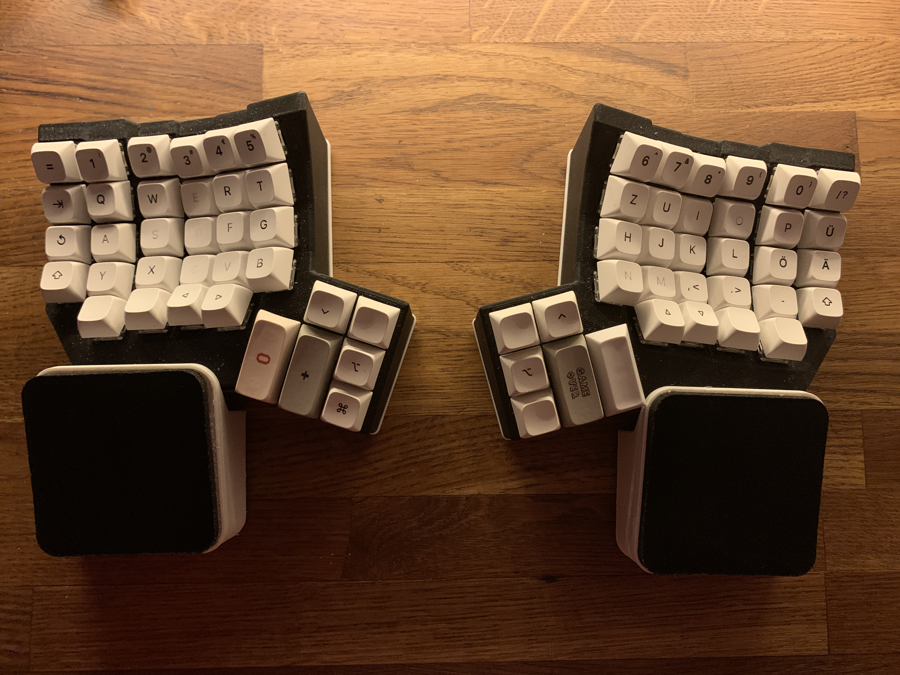

# Custom ZMK-Xiao-Flex Dactyl CC Firmware

Welcome to my firmware repository for the custom-built ZMK-Xiao-Flex Dactyl CC mechanical keyboard!

 <!-- You can replace 'keyboard.jpg' with the actual image file name if you have one -->

## About the Keyboard
- This unique keyboard was meticulously crafted by [Marshall Somerville](https://github.com/WainingForests/zmk-xiao-flex) (GitHub profile).
- You can explore more of Marshall's creations on their [Etsy shop](https://www.etsy.com/de-en/shop/TheBigSkree).

## Features
- Custom firmware to work with the ZMK firmware framework.
- German layout with support for 'Umlaute' and other special characters.
- Use preset actions to automatically create firmware that can be flashed on the keyboard.

## Contributions
- Contributions and improvements are welcome! Feel free to fork this repository and create pull requests.
- Let me know if you need support :)

Happy typing 
