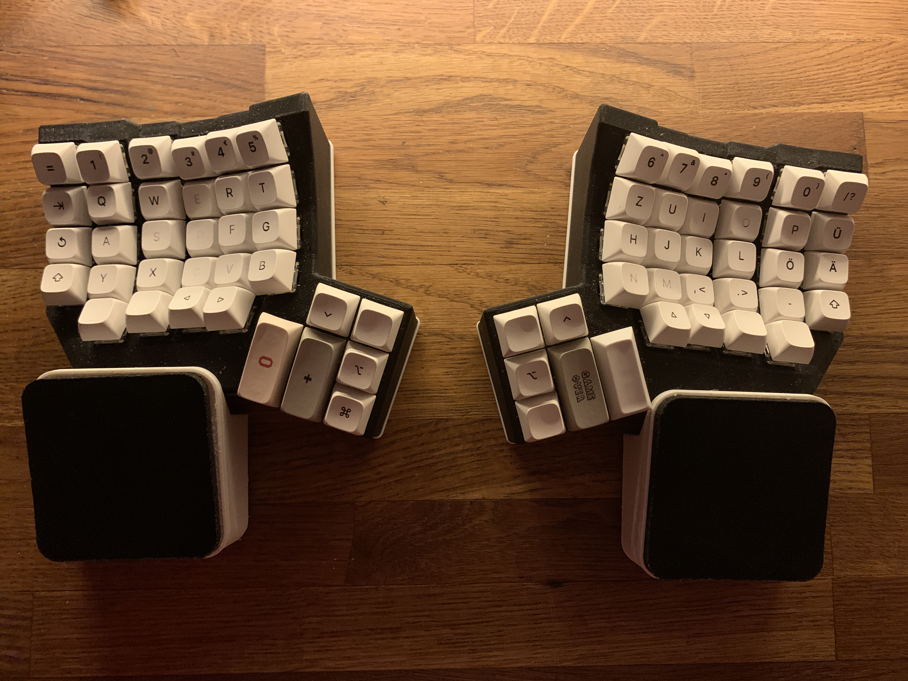

# Custom ZMK-Xiao-Flex Dactyl CC Firmware

Welcome to my firmware repository for the custom-built ZMK-Xiao-Flex Dactyl CC mechanical keyboard!

 <!-- You can replace 'keyboard.jpg' with the actual image file name if you have one -->

## About the Keyboard
- This unique keyboard was meticulously crafted by [Marshall Somerville](https://github.com/WainingForests/zmk-xiao-flex) (GitHub profile).
- You can explore more of Marshall's creations on their [Etsy shop](https://www.etsy.com/de-en/shop/TheBigSkree).

## Features
- Custom firmware to work with the ZMK firmware framework.
- German layout with support for 'Umlaute' and other special characters.
- Use preset actions to automatically create firmware that can be flashed on the keyboard.

# Connecting dactyl_cc to Linux over Bluetooth

## Background

Split keyboard, two XIAO BLE halves. Per `config/boards/shields/dactyl_cc/Kconfig.defconfig`, the **left half is BLE central** (the one that actually pairs with the host computer). The right half is peripheral — it only talks to the left half over its own internal link, and forwards keypresses to it. `mo1`, `BT_CLR`, and `BT_SEL 0/1/2` live physically on the right half, but they still correctly act on the left half's Bluetooth state.

Firmware config in `config/dactyl_cc.conf` needed for reliable Linux pairing:

```bash
CONFIG_BT_CTLR_PHY_2M=n
CONFIG_ZMK_BLE_PASSKEY_ENTRY=y
CONFIG_BT_GATT_AUTO_SEC_REQ=y
```

## Normal connection (already paired)

Power on both halves. It should reconnect automatically to whichever BT_SEL profile was last selected. If it doesn't within a few seconds, see troubleshooting below.

## First-time pairing (or re-pairing a slot)

1. On the keyboard: hold `mo1`, tap `BT_SEL <n>` for the profile slot you want, release.
2. On the laptop, use `bluetoothctl" directly rather than the GNOME Settings GUI — the GUI swallows real error messages and just spins on failure.

```bash
bluetoothctl
power on
agent DisplayYesNo
default-agent
scan on
```
3. Watch for the keyboard's name/MAC (advertises as `dactyl_cc`) in the scrolling output.
4. Pair explicitly (don't just `connect` — BLE HID needs a full pairing/bonding handshake first or it'll connect then immediately drop):

```bash
pair <MAC-ADDRESS>
```

5. A **passkey** will appear: `[agent] Passkey: ######`. Immediately switch focus to the physical keyboard and type those 6 digits on the number row (no `mo1` needed), then press **Enter** on the keyboard. You have a short window (~30s) before it times out.
6. Once paired:

```bash
trust <MAC-ADDRESS>
connect <MAC-ADDRESS>
```

## Troubleshooting

**Symptom: `Connected: yes` immediately followed by `LE.Disconnected — Reason.Local`,
no passkey ever shown, `Failed to pair: org.bluez.Error.AuthenticationFailed`.**

Check kernel log during a live attempt:

```bash
sudo dmesg -w
```
If you see `Bluetooth: hci0: unexpected SMP command 0x0b from <mac>` — this is a known, long-standing Linux kernel/BlueZ bug affecting many BLE split keyboards (see [zmkfirmware/zmk#1487](https://github.com/zmkfirmware/zmk/issues/1487)), not specific to
this board. Fixed by the three Kconfig lines above (`PHY_2M=n` + `BLE_PASSKEY_ENTRY=y` + `GATT_AUTO_SEC_REQ=y`). If that combination doesn't clear it, the more aggressive fallback used by others in that thread is:

```bash
CONFIG_ZMK_BLE_EXPERIMENTAL_FEATURES=y
```

**Symptom: `Failed to pair: org.bluez.Error.AuthenticationCanceled`, passkey did appear.**

Just a timing miss — the passkey wasn't typed on the keyboard fast enough. Retry `pair`
and be ready to type the digits + Enter the instant the passkey prints.

**Stale bond on either side** (e.g. after reflashing, or after previously pairing to a
different OS like macOS):

- Laptop side: `remove <MAC>` in `bluetoothctl` before retrying.
- Keyboard side: hold `mo1`, tap `BT_CLR` on the active profile slot, before retrying.

Do both together, not just one.

**General diagnostics:**
```bash
rfkill list                                         # confirm BT isn't soft/hard blocked
journalctl -b -u bluetooth --no-pager | tail -50    # after a failed attempt
bluetoothctl info <MAC>                             # check Paired/Bonded/Trusted state
```

## Build/flash gotchas hit along the way (unrelated to BT, but easy to re-trip)

- `build.yaml` board name must be `xiao_ble/nrf52840/zmk` (the plain `xiao_ble` or old
  `seeeduino_xiao_ble` names fail — Zephyr 4.1 requires the explicit `/zmk` board variant).
- Don't set unused Kconfig options to `=n` to "disable" them — if the symbol doesn't
  exist for this board/shield (e.g. `CONFIG_WS2812_STRIP` with no LED strip hardware),
  any assignment at all triggers "undefined symbol" and aborts the build. Delete the
  line entirely instead.

# Contributions
- Contributions and improvements are welcome! Feel free to fork and use it for your keyboard.
- Let me know if you need support :)

Happy typing 
